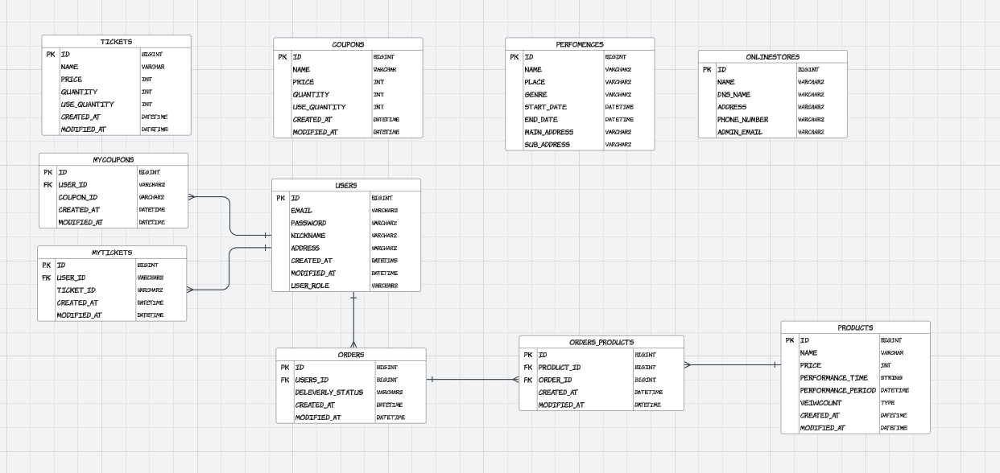

# 플러스주차 프로젝트
#### 팀노션 https://teamsparta.notion.site/05-1382dc3ef51481e894dfe74ab72746b9

## 주요기능 소개
- ### 회원가입, 로그인
  - Jwt토큰을 이용하여 로그인기능구현
  - 유저 등록 메인 게시판에는 상품(뮤지컬,콘서트,스포츠)목록 출력
- ### 상품CRUD 기능 구현
  - 상품생성
  - 상품단건, 다건, 조회
- ### 주문CRUD 기능 구현
  - 주문 가능
  - 주문목록 출력
- ### 배송CRUD 기능 구현
  - 배송 기능 
  - 배송 중 - 배송완료에 대한 목록 출력 
- ### 공연정보조회 기능 구현
  - 데이테베이스에 저장된 유저정보 출력 
- ### 쿠폰생성 및 발급기능 구현

## API
| 기능          | method | URL                                 | request                                                                                                                     | response                                                                                                                                                                                                                                                                                                                                                                                                                                                                                                                                                                                                                                             |
|-------------|--------|-------------------------------------|-----------------------------------------------------------------------------------------------------------------------------|------------------------------------------------------------------------------------------------------------------------------------------------------------------------------------------------------------------------------------------------------------------------------------------------------------------------------------------------------------------------------------------------------------------------------------------------------------------------------------------------------------------------------------------------------------------------------------------------------------------------------------------------------|
| 회원가입        | Post   | auth/register                       | {   "email": "tst@example.com",   "password": "1234",   "nickname": "spring",   "address": "seoul",   "userRole" : "USER" } | 1                                                                                                                                                                                                                                                                                                                                                                                                                                                                                                                                                                                                                                                    |
| 로그인         | Post   | auth/login                          | {   "email": "tst@example.com",   "password": "1234" }                                                                      | 1                                                                                                                                                                                                                                                                                                                                                                                                                                                                                                                                                                                                                                                    |
| 상품생성        | Post   | /api/v1/products                    | {   “name” : ,   “price”  : ,  “ performanceTime” : ,    “performancePeriod” :  }                                           | {   “id” : 1,   “name” : ,   “price”  : ,  “ performanceTime” : ,    “performancePeriod” :  }                                                                                                                                                                                                                                                                                                                                                                                                                                                                                                                                                        |
| 상품단건조회      | Get    | /api/v1/products/{productId}        | 없음                                                                                                                          | {   “id” : 1,   “name” : ,   “price”  : ,  “ performanceTime” : ,    “performancePeriod” :  }                                                                                                                                                                                                                                                                                                                                                                                                                                                                                                                                                        |
| 상품리스트 조회    | Get    | /api/v1/products                    | 없음                                                                                                                          | {    {   “id” : 1,   “name” : ,   “price”  : ,  “ performanceTime” : ,    “performancePeriod” :     } ,    {   “id” : 2,   “name” : ,   “price”  : ,  “ performanceTime” : ,    “performancePeriod” :     } ,    {   “id” : 3,   “name” : ,   “price”  : ,  “ performanceTime” : ,    “performancePeriod” :     } pageinfo{   … } }                                                                                                                                                                                                                                                                                                                  |
| 캐싱을이용한 상품조회 | Get    | /api/v2/products/{productId}        | 없음                                                                                                                          | {   "id": 1,   "name": "알라딘",   "price" : 10000,   "performanceTime": "150분",    "performancePeriod": "2024-12-25",   "count": 6    }                                                                                                                                                                                                                                                                                                                                                                                                                                                                                                                |
| 주문생성        | Post   | /api/v1/products/{productId}/orders | 없음                                                                                                                          | {    "id": 1,   "productName": "서울 오페라 공연",   "price": 100000,   "createdAt": "2024-11-25 11:00:00" }                                                                                                                                                                                                                                                                                                                                                                                                                                                                                                                                                |
| 주문조회        | Get    | /api/v1/orders                      | 없음                                                                                                                          | {   "contents": [   {    "id": 1,    "productName": "서울 오페라 공연",    "price": 200000,    "status": "READY",    "createdAt": "2024-10-21 10:00:00",    "modifiedAt": "2024-10-21 10:00:00"    },   {     "id": 2,      "productName": "서울 뮤지컬 공연",     "price": 180000,     "status" : "SHIPPING",     "createdAt": "2024-10-21 10:00:00",     "modifiedAt": "2024-10-22 12:00:00"     },    {      "id" : 3,      "productName": "대전 뮤지컬 공연",     "price": 120000,     "status": "COMPLETED",     "createdAt": "2024-10-21 10:00:00",     "modifiedAt": "2024-10-23 14:30:00"     }   ]   {    "page": 2,    "pagesize": 10,    "totalPage": 12    } } |
| 주문정보변경      | Put    | /api/v1/orders/{orderId}/status     |                                                                                                                             |                                                                                                                                                                                                                                                                                                                                                                                                                                                                                                                                                                                                                                                      |
| 주문정보 삭제     | Delet  | /api/vi/orders/{orderId}            | { "id": 2, }                                                                                                                | 없음                                                                                                                                                                                                                                                                                                                                                                                                                                                                                                                                                                                                                                                   |
| 쿠폰발급        | Post   | /api/v1/coupones                    | 없음                                                                                                                          |{   "id": 1,   "name" : "할인쿠폰",   "price": 1000,  "createdAt": "2024-11-27-11:00:00" }|
| 티켓생성        | Post   | /api/v1/tickets                     | {    "name": "Spring" ,     "price": 1000,     "quantity": 100,     "useQuantity": 0  }                                     |{    "id": 1,    "name": "Spring",    "price": 1000,     "quantity": 100,     "useQuantity": 0 }|
| 티켓발급        | Post   | /api/ticket/{ticketId}              | {"seatNumber": "A1"}                                                                                                        |{"id": 1}|
| 공연정보조회      | Get    | /api/v1/performances/1              | 없음                                                                                                                          |{     "id": 1,     "name": "8년 연속 1위 연극〈옥탑방고양이〉",     "genre": "연극",     "place": "틴틴홀",     "mainAddress": "서울특별시",     "subAddress": "종로구",     "startData": "2010-04-06",     "endData": "2018-12-31" }|

## 와이어프레임

## ERD

## Branch 전략
Type / {도메인 이름} / {구현 기능} - {이슈 번호}
- Ex. `faet/user/login-21`
- Ex. `feat/cache/viewCount-53`
---
## Commit 전략
git commit -m “[#이슈번호] Type(변경된 클래스) : 커밋내용”
- Ex. `[#13] feat(UserService) : 회원가입 구현`
- Ex  `[#35] feat(CommentService) : 댓글 삭제 구현`
- Ex. `[#12] test(TodoServiceTest) : 테스트 코드 작성`